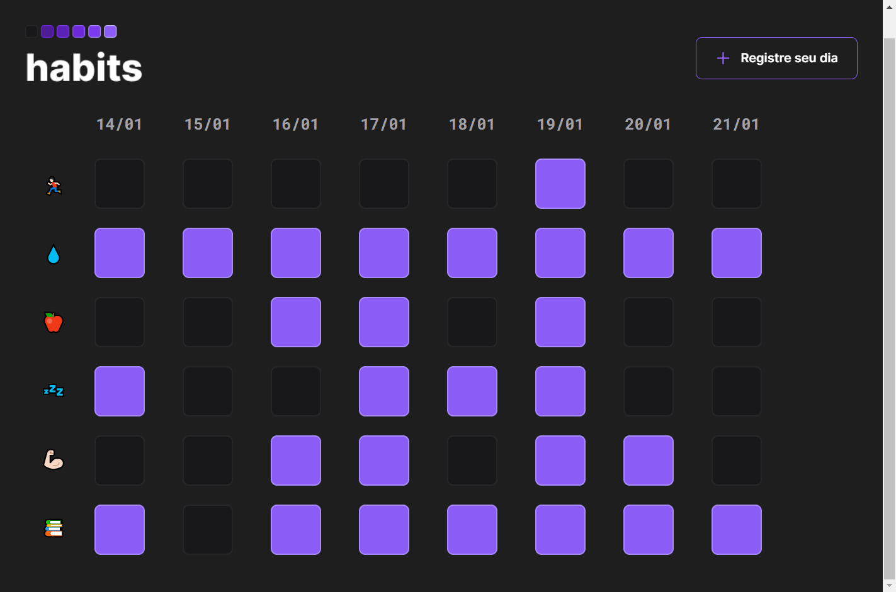

<h1 align="center"> Habits </h1>

  <a href="#-tecnologias">Tecnologias</a>&nbsp;&nbsp;&nbsp;|&nbsp;&nbsp;&nbsp;
  <a href="#-projeto">Projeto</a>&nbsp;&nbsp;&nbsp;|&nbsp;&nbsp;&nbsp;
  <a href="#memo-licença">Licença</a>

  

 

  

## 🚀 Tecnologias

Esse projeto foi desenvolvido com as seguintes tecnologias:

- HTML
- CSS
- JavaScript
- Figma
- Git 
- Github

## 💻 Projeto

Habists criado no evento NLW Setup da Rocketseat, onde foi proposta a ideia de criar um habit tracker para 
ter um controle de atividades diárias.

- [Acesse o projeto finalizado, online](https://my-links-me.vercel.app/)

## :memo: Licença

Esse projeto está sob a licença MIT.